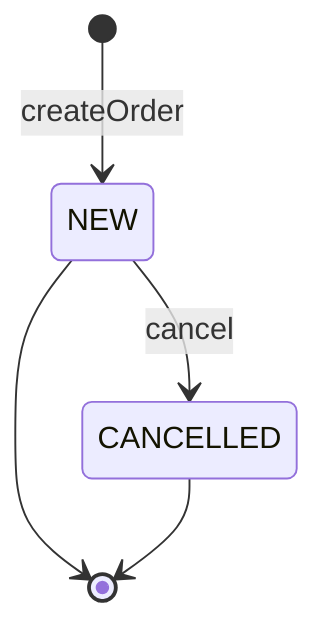
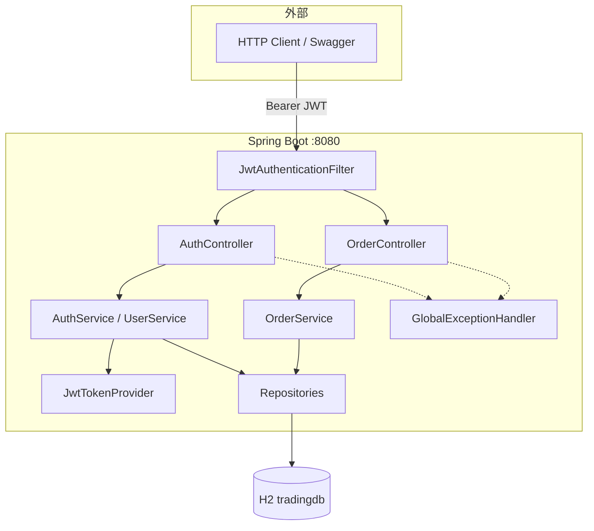
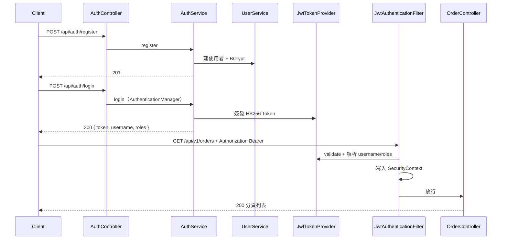
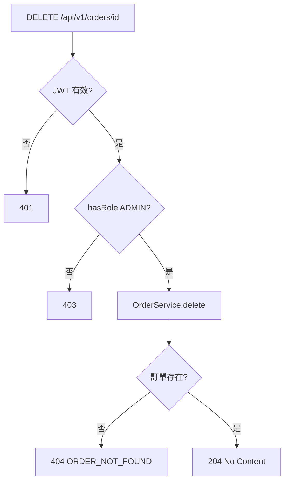

# TradingSpringSecurity — 專案引導教學

> 單檔導覽：60 秒搞懂運作規則 → 流程圖 → API／錯誤碼 → 5 分鐘驗證。  
> 衝突以 [規格書.md](../規格書.md) 為準。

---

## 目錄

1. [60 秒速覽](#1-60-秒速覽--這專案在幹嘛)
2. [運作規則](#2-運作規則必記)
3. [分層職責](#3-分層職責)
4. [狀態與角色](#4-狀態與角色)
5. [系統架構](#5-系統架構)
6. [認證時序](#6-認證時序-jwt)
7. [訂單流程](#7-訂單流程)
8. [四層驗證](#8-四層驗證)
9. [API 端點速查](#9-api-端點速查)
10. [例外／錯誤碼對照](#10-例外錯誤碼對照)
11. [關鍵類別地圖](#11-關鍵類別地圖)
12. [5 分鐘實作驗證](#12-5-分鐘實作驗證)
13. [文件地圖](#13-文件地圖)

---

## 1. 60 秒速覽 — 這專案在幹嘛？

**一句話：**用 Spring Security + JWT（無 Session）保護訂單 CRUD，示範註冊／登入、角色授權（USER／ADMIN）、以及 `clientOrderId` 冪等下單。

| 幹線 | 內容 |
|------|------|
| **A · 認證** | `POST /api/auth/register` → `login` 拿 JWT → 之後帶 `Authorization: Bearer …` |
| **B · 訂單** | 建單／查詢／取消／刪除；DELETE 僅 ADMIN；冪等鍵衝突回 409 |

**技術摘要**

| 項 | 值 |
|----|-----|
| Port | `8080` |
| 資料 | JPA + H2（`jdbc:h2:mem:tradingdb`） |
| 安全 | BCrypt + JWT HS256 + STATELESS |
| 前端 | **無**（curl／Swagger） |
| 對照 | 有 Security／分層；**無** Kafka／Redis（見 TradingSpringBoot） |

---

## 2. 運作規則（必記）

1. **無狀態 API** — Session 關閉；每個請求靠 JWT 重建 `SecurityContext`。
2. **Controller 不含商業邏輯** — 只做 HTTP、`@Valid`、委派 Service、回傳 DTO。
3. **授權集中在 `SecurityConfig`** — 公開路徑 `permitAll`；`DELETE /api/v1/orders/**` → `hasRole("ADMIN")`；其餘需 `authenticated()`。
4. **冪等靠 `clientOrderId` UNIQUE** — Service 先查再寫；重複 → `409 DUPLICATE_ORDER`。
5. **密碼只存 BCrypt 雜湊** — 登入用 `AuthenticationManager` 驗證，成功後由 `JwtTokenProvider` 簽發 Token。

---

## 3. 分層職責

| 層 | 套件／類別 | 做什麼 | 禁止 |
|----|------------|--------|------|
| Controller | `AuthController`、`OrderController` | 路由、驗證、HTTP 狀態 | 改 Entity、碰 JWT 細節 |
| Service | `AuthService`、`UserService`、`OrderService` | 註冊／登入／訂單規則、交易 | 組裝 HTTP 狀態碼 |
| Security | `JwtTokenProvider`、`JwtAuthenticationFilter` | 簽發／驗證／寫入 SecurityContext | 業務 CRUD |
| Repository | `UserRepository`、`OrderRepository` | JPA 存取 | 商業規則 |
| Entity / DTO / Domain | `entity`、`dto`、`domain` | 持久化與 API 契約 | 混用進出欄位 |
| Config | `SecurityConfig`、`OpenApiConfig` | 過濾鏈、Swagger | 業務邏輯 |
| Exception | `GlobalExceptionHandler` + 領域例外 | 例外 → 結構化錯誤 | 洩漏堆疊 |

---

## 4. 狀態與角色

### 角色

| Role | 能力 |
|------|------|
| `USER` | 註冊預設；可建單／查詢／取消 |
| `ADMIN` | 同上 + **刪除訂單** |

### 訂單狀態（概念）



建單初始為 `NEW`；取消走 `PATCH …/cancel`。刪除為 ADMIN 實體刪除（非狀態變更）。

---

## 5. 系統架構



執行時路徑（文字版）：

```text
Client (Bearer JWT)
  → JwtAuthenticationFilter
  → AuthController / OrderController
      → AuthService / OrderService / UserService
          → Repository → H2
```

---

## 6. 認證時序（JWT）



**設定關鍵**

| 項目 | 位置 |
|------|------|
| Secret／過期 | `app.jwt.secret`、`app.jwt.expiration-ms`（預設 1 小時） |
| Session | `SessionCreationPolicy.STATELESS` |
| CSRF | 關閉（純 API + JWT） |
| 公開路徑 | `/api/auth/**`、Swagger、`/actuator/health`、`/h2-console/**` |

---

## 7. 訂單流程

### 建單（含冪等）

```mermaid
flowchart TD
    A[POST /api/v1/orders + JWT] --> B{已認證?}
    B -->|否| C[401]
    B -->|是| D[@Valid CreateOrderRequest]
    D -->|失敗| E[400 VALIDATION_FAILED]
    D -->|通過| F[OrderService.createOrder]
    F --> G{clientOrderId 已存在?}
    G -->|是| H[409 DUPLICATE_ORDER]
    G -->|否| I[存 OrderEntity status=NEW]
    I --> J[201 OrderResponse]
```

### 刪除（角色閘門）



---

## 8. 四層驗證

| 層 | 機制 | 典型失敗 |
|----|------|----------|
| L1 傳輸／認證 | JWT Bearer、`SecurityFilterChain`、`hasRole("ADMIN")` | 401／403 |
| L2 格式 | DTO `@Valid` | 400 `VALIDATION_FAILED` |
| L3 業務 | Service（冪等、不存在、帳號重複） | 404／409 |
| L4 資料 | DB UNIQUE／NOT NULL | 應少見（L3 先攔） |

### 權限矩陣

| 端點 | 公開 | USER | ADMIN |
|------|------|------|-------|
| `POST /api/auth/register`、`/login` | ✅ | — | — |
| Swagger／health／h2-console | ✅ | — | — |
| `POST`／`GET`／`PATCH /api/v1/orders/**` | — | ✅ | ✅ |
| `DELETE /api/v1/orders/{id}` | — | — | ✅ |

---

## 9. API 端點速查

### 認證

| Method | URL | 成功 |
|--------|-----|------|
| POST | `/api/auth/register` | 201 |
| POST | `/api/auth/login` | 200 + JWT |

### 訂單（需 Bearer；DELETE 需 ADMIN）

| Method | URL | 成功 |
|--------|-----|------|
| POST | `/api/v1/orders` | 201 |
| GET | `/api/v1/orders` | 200 分頁 |
| GET | `/api/v1/orders/{id}` | 200 |
| PATCH | `/api/v1/orders/{id}/cancel` | 200 |
| DELETE | `/api/v1/orders/{id}` | 204 |

### 運維／文件

| URL | 說明 |
|-----|------|
| http://localhost:8080/swagger-ui.html | OpenAPI UI |
| http://localhost:8080/h2-console | H2（JDBC：`jdbc:h2:mem:tradingdb`） |
| `/actuator/health` | 健康檢查 |

---

## 10. 例外／錯誤碼對照

| 情境 | HTTP | errorCode |
|------|------|-----------|
| 欄位驗證失敗 | 400 | `VALIDATION_FAILED` |
| 帳密錯誤／未帶 token | 401 | `INVALID_CREDENTIALS`／— |
| 非 ADMIN 刪除 | 403 | — |
| 訂單不存在 | 404 | `ORDER_NOT_FOUND` |
| 冪等重複／帳號已存在 | 409 | `DUPLICATE_ORDER`／`USERNAME_EXISTS` |

對照程式：`GlobalExceptionHandler`、`DuplicateOrderException`、`OrderNotFoundException`、`UsernameAlreadyExistsException`。

---

## 11. 關鍵類別地圖

| 路徑 | 一句話 |
|------|--------|
| `config/SecurityConfig.java` | 過濾鏈、公開路徑、ADMIN 刪除、BCrypt |
| `security/JwtTokenProvider.java` | JWT 簽發／驗證／解析 |
| `security/JwtAuthenticationFilter.java` | Header → SecurityContext |
| `controller/AuthController.java` | 註冊／登入入口 |
| `controller/OrderController.java` | 訂單 REST 入口 |
| `service/AuthService.java` | 認證用例 |
| `service/UserService.java` | 使用者與角色 |
| `service/OrderService.java` | 訂單 + 冪等 |
| `entity/UserEntity.java` / `OrderEntity.java` | JPA 映射 |
| `exception/GlobalExceptionHandler.java` | 統一錯誤 JSON |

套件樹：

```text
com.trading.security
├── config/       SecurityConfig, OpenApiConfig
├── controller/   AuthController, OrderController
├── service/      AuthService, UserService, OrderService
├── repository/   UserRepository, OrderRepository
├── entity/       UserEntity, OrderEntity
├── dto/          RegisterRequest, LoginRequest, JwtResponse, ...
├── domain/       Role, OrderStatus, OrderSide
├── security/     JwtTokenProvider, JwtAuthenticationFilter
└── exception/    GlobalExceptionHandler + 領域例外
```

---

## 12. 5 分鐘實作驗證

### 步驟 1 — 啟動

```powershell
cd D:\ClaudeCode\TradingSpringSecurity
. .\scripts\env.ps1
.\gradlew.bat bootRun
```

等待 `:8080` 就緒。

### 步驟 2 — 註冊

```powershell
curl -X POST http://localhost:8080/api/auth/register `
  -H "Content-Type: application/json" `
  -d "{\"username\":\"alice\",\"password\":\"password123\"}"
```

預期 **201**。

### 步驟 3 — 登入拿 Token

```powershell
curl -X POST http://localhost:8080/api/auth/login `
  -H "Content-Type: application/json" `
  -d "{\"username\":\"alice\",\"password\":\"password123\"}"
```

預期 **200**，回應含 `token`。之後設環境變數：

```powershell
$TOKEN = "<貼上 token>"
```

### 步驟 4 — 建單

```powershell
curl -X POST http://localhost:8080/api/v1/orders `
  -H "Authorization: Bearer $TOKEN" `
  -H "Content-Type: application/json" `
  -d "{\"clientOrderId\":\"ORD-001\",\"symbol\":\"AAPL\",\"side\":\"BUY\",\"quantity\":10,\"price\":150.00}"
```

預期 **201**，`status` 為 `NEW`。

### 步驟 5 — 冪等（應 409）

再用同一個 `clientOrderId` 打一次 → 預期 **409** `DUPLICATE_ORDER`。

### 步驟 6 — 無 Token（應 401）

```powershell
curl http://localhost:8080/api/v1/orders
```

預期 **401**。

### 步驟 7 — 測試全綠

```powershell
.\scripts\check.ps1
# 或
.\gradlew.bat check
```

報告：

- `build/reports/tests/test/index.html`
- `build/reports/tests/integrationTest/index.html`

**自測口訣：**建單 201、無 token 401、驗證失敗 400、冪等 409、非 ADMIN 刪除 403、ADMIN 刪除 204。

---

## 13. 文件地圖

| 文件 | 用途 |
|------|------|
| [規格書.md](../規格書.md) | **主規格（權威）** |
| [TradingSpringSecurity-SPEC.md](../TradingSpringSecurity-SPEC.md) | EOS 英文入口 |
| [README.md](../README.md) | 快速開始 |
| [architecture.md](architecture.md) | 分層與模組 |
| [驗證設計.md](驗證設計.md) | JWT、權限矩陣、錯誤碼 |
| [資料庫設計.md](資料庫設計.md) | 表、Entity、H2 |
| [testing.md](testing.md) / [測試與CI.md](測試與CI.md) | 測試摘要與 Case ID |
| **本頁** `專案引導教學.md` | 規則 + 流程圖 + 驗證 |

---

*TradingSpringSecurity 專案引導教學 · 2026-07-17 · Spring Boot 3.2 · Security(JWT) · JPA · H2*
